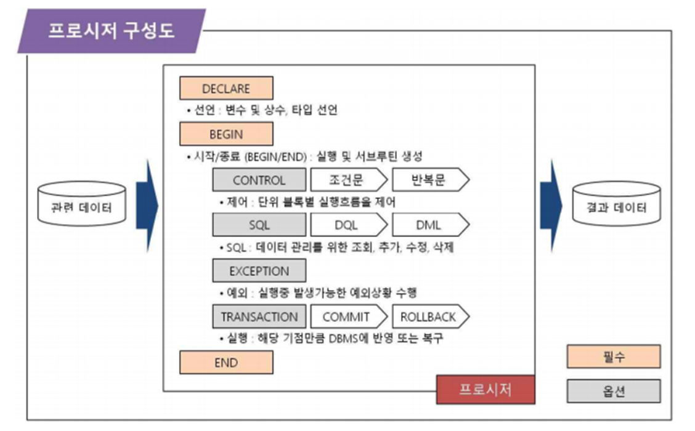
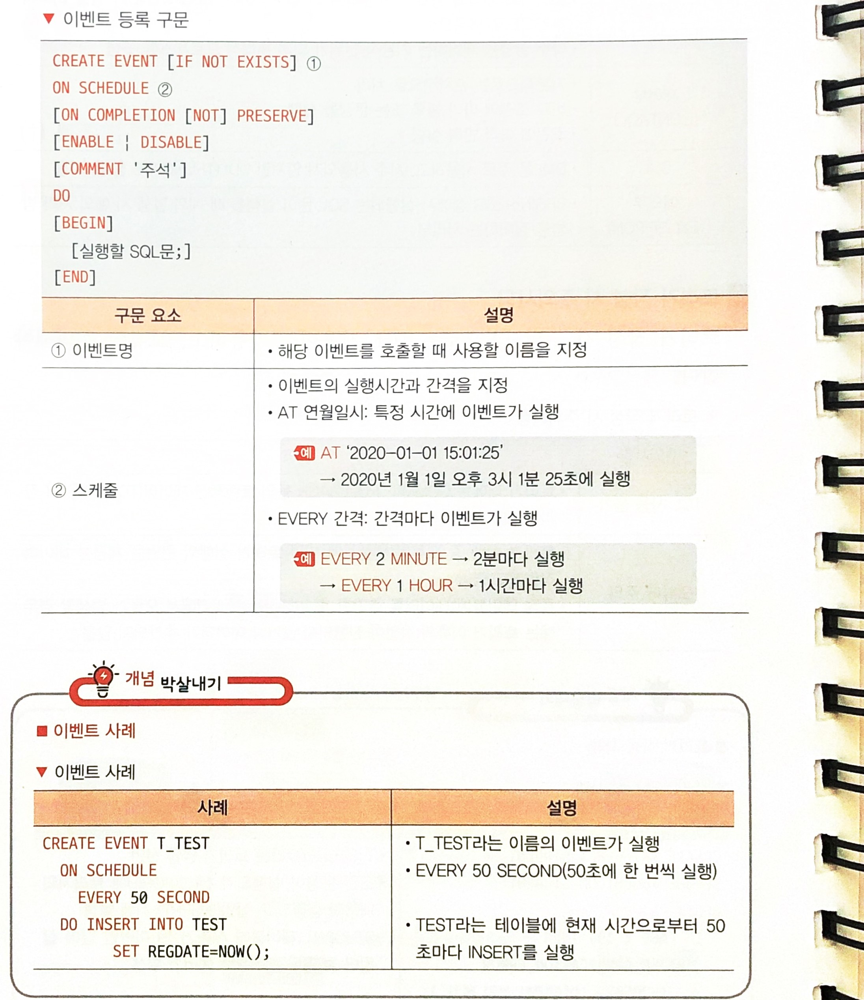
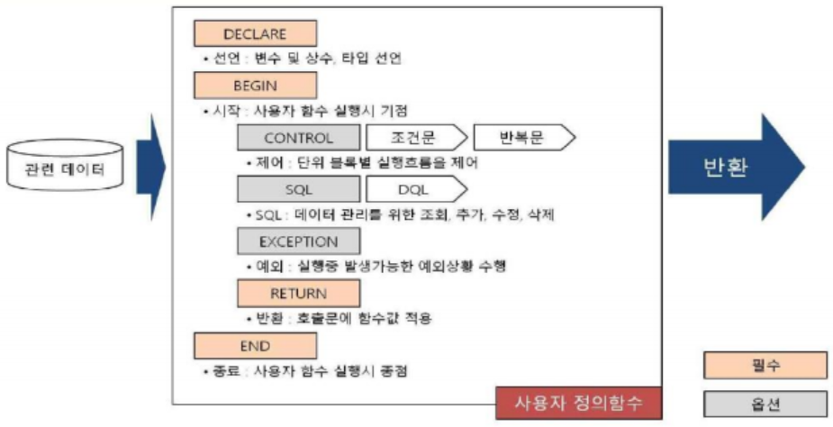
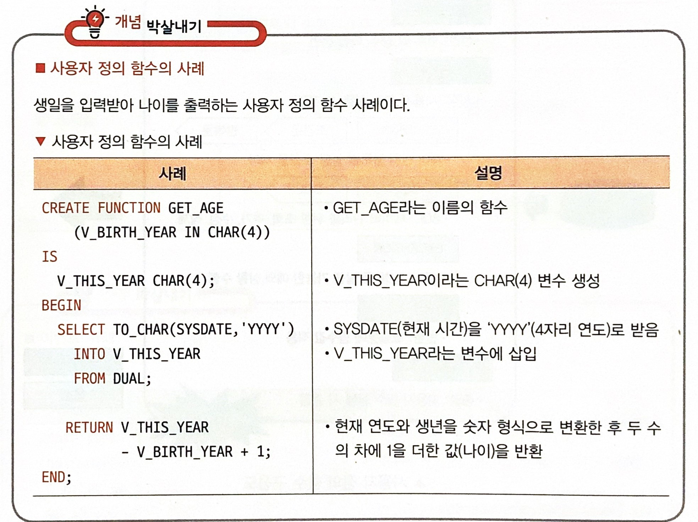

### 1. 2022년 01월 23일 정보처리기사

<h1>절차형 SQL 작성</h1><br>

# 1. <span style ="color:red">트리거

- 트리거의 개념

  - 트리거는 데이터베이스 시스템에서 삽입, 갱신, 삭제 등의 이벤트가 발생할 때마다 관련 작업이 자동으로 수행되는 절차형 SQL이다.

  ```
  ☆ 이벤트(Event)
    → 특정 시간에 특정한 쿼리, 함수 등을 실행시키는 기능이다.

  ☆ 데이터 무결성
    → 데이터베이스에 저장된 데이터 값과 그것이 표현하는 실제 값이 일치하는 정확성을 의미한다.

  ☆ 로그 메시지
    → 시스템의 모든 기록을 담고 있는 데이터이다.
  ```

- 트리거의 목적

  - 일반적으로 이벤트와 관련된 테이블의 데이터 삽입, 추가, 삭제 작업을 DBMS가 자동적으로 실행시키는 데 활용한다.
  - <span style='color:red'>데이터 무결성</span> 유지 및 <span style='color:red'>로그 메시지</span> 출력 등의 별도 처리를 위해 사용되기도 한다.

- 트리거의 구성<br>
  
  |구성요소|설명|
  |----------|----------|
  |선언부(Declare)|트리거의 명칭을 정의하는 부분|
  |이벤트부(Event)|트리거가 실행되는 타이밍, 이벤트를 명시하는 부분|
  |시작/종료부<br>(Begin/End)|트리거가 시작과 종료를 표현하는데 필수적이며, Begin/End가 쌍을 이루어 추가되므로 블록을 구성<br>다수 실행을 제어하는 기본적 단위가 되며 논리적 프로세스를 구성|
  |제어부(Control)|기본적으로는 순차적으로 처리<br>비교 조건에 따라 블록 또는 문장을 실행<br>조건에 따라 반복실행|
  |SQL|DML을 주로 사용하고, 자주 사용되지 않지만 DDL(Truncate등)을 사용|
  |예외부(Exception)|Begin ~ End 절에서 실행되는 SQL 문이 실행될 때 예외 발생 시 예외 처리 방법을 정의하는 처리부|

- 트리거 작성시 주의 사항
  - 트리거 작성 시 주의 사항으로는 TCL 사용이 불가능 하고, 오류에 주의해야 한다.
    |주의사항|설명|
    |---------|-----------|
    |TCL 사용불가| 트리거 내에서는 Commit,Rollback 등의 트랜잭션 제어어(TCL)사용 시 컴파일 에러 발생|
    |오류에 주의| 트리거 실행 중 오류가 발생하게 되면 트리거 실행의 원인을 제공한 데이터 작업에도 영향<br>특정 테이블에 데이터를 추가한 후 발생하는 트리거에서 오류가 발생할 경우에는 트리거 이후의 작업이 진행되지 않거나 데이터가 추가되지 않음|

```
  트리거 작성사례
  CREATE  TRIGGER T_STUDENT     * T_STUDENT 라는 트리거 명을 선언
  BEFORE INSERT ON STUDENT      * 조건문장이 실행되기전(Before)에 트리거의 내용이
  BEGIN                           실행되고, 삽입(Insert)시에 발생
    IF(AGE<19) THEN             * Student 테이블에 AGE가 19 미만인 값이 삽입 될
      RAISE_APPLICATION_ERROR     경우 20502번 에러가 발생
        (-20502,'미성년자 삽입 불가');
      END IF;
    END
```

# 2. 이벤트

- 이벤트의 개념

  - 이벤트는 특정 시간에 특정한 쿼리, 프로시저, 함수 등을 실행시키는 기능이다.

- 이벤트 구문
  

# 3. 사용자 정의 함수

- 사용자 정의 함수 (USER-Defined Function)개념
  - 사용자 정의 함수는 절차형SQL을 활용하여 일련의 연산 처리 결과를 단일 값으로 반환 할 수 있는 함수이다.
  - DBMS에서 제공되는 공통적 함수 이외에 사용자가 직접 정의하고 작성한다.

```
절차형 SQL
  일반적인 개발 언어처럼 절차 지향적인 프로그램이 가능한 SQL로, 절차형 SQL을 이용하면 SQL 문의 연속적인 실행이나 조건에 따른 분기처리를 이용하여 특정 기능을 수행하는 저장 모듈을 생성 할 수 있다.
```

- 사용자 정의 함수 특징

  - 일반적으로 사용자 정의 함수는 호출을 통해 실행되며, 반환되는 단일 값을 조회 또는 삽입,수정 작업에 이용한다.
  - 프로시저와의 가장 큰 차이점은 기본적인 개념 및 사용법, 문법 등은 프로시저와 동일하며, 종료 시 단일 값을 반환한다는 점이다.

- 사용자 정의 함수 구성
  

  | 구성요소                   | 설명                                                                                                                                                                  |
  | -------------------------- | --------------------------------------------------------------------------------------------------------------------------------------------------------------------- |
  | 선언부(Declare)            | 프로시저의 명칭, 변수와 인수 그리고 그에 대한 데이터 타입을 정의하는 부분                                                                                             |
  | 시작/종료부<br>(Begin/End) | 프로시저의 시작과 종료를 표현하는 데 필수적이며, Begin & End가 쌍을 이루어 추가되므로 블록으로 구성<br>다수 실행을 제어하는 기본적 단위가 되며 논리적 프로세스를 구성 |
  | 제어부(Control)            | 기본적으로는 순차적으로 처리<br>비교 조건에 따라 블록 또는 문장을 실행<br>조건에 따라 반복실행                                                                        |
  | SQL                        | 조회 용도로 Select문을 사용 <br> 데이터를 조작하는 Insert, Delete, Update는 사용 할 수 없음                                                                           |
  | 예외부(Exception)          | Begin ~ End 절에서 실행되는 SQL 문이 실행될 때 예외 발생 시 예외 처리 방법을 정의하는 처리부                                                                          |
  | 반환부(Return)             | 호출문에 대한 함수 값을 반환                                                                                                                                          |



- 사용자 정의 함수는 프로시저와 동일하게 외부에서의 호출을 통해 실행한다.
- 비교적 단순한 결과값을 구하는 것이 보통이며, 또는 타 시스템에 정보 제공 등 은닉을 통해 <span style='color:red'>캡슐화</span>를 제공하는 데에도 많이 사용한다.

```
캡슐화(Encapsulation)
객체의 속성과 행위를 하나로 묶고 실제 구현 내용 일부를 외부에 감추어 은닉하는 기법이다.
```

- 사용자 정의 함수 호출쿼리 작성 문법

| 문법                                                                                                                                                     | 설명                                                                                                                            |
| -------------------------------------------------------------------------------------------------------------------------------------------------------- | ------------------------------------------------------------------------------------------------------------------------------- |
| SQL> SELECT 함수명(파라미터,...) <br>FROM 테이블명;<br><br>SQL>UPDATE EMPLOYEE_INFO_T<BR>SET AGE = GET_AGE(BIRTH_DATE)<BR>WHERE EMPLOYEE_ID = '2017001'; | 생년월일 값(1990년1월1일)을 가지고 연령값을 가져오는 사례<br> 직원 아이디를 활용하여 생일 컬럼 내의 값에 직접 적용, 연령값 수정 |

# 4. <span style='color:red'>SQL 문법</span>

- SQL(STRUCTURED QUERY LANGUAGE) 문법의 개념

  - SQL 문법은 데이터베이스를 접근하고 조작하는 데 필요한 표준 언어를 활용 할 수 있게 해주는 규칙이다.

- SQL 문법의 분류
  |분류|설명|
  |------|------|
  |데이터정의(DDL)|데이터 정의어는 데이터를 정의하는 언어<br>테이블이나 관계의 구조를 생성하는 데 사용<br>CREATE,ALTER,DROP,TRUNCATE 문이 있음|
  |데이터 조작어(DML)|데이터베이스에 저장된 자료들을 입력, 수정, 삭제, 조회하는 언어<BR>SELECT,INSERT,UPDATE,DELETE 문이 있음<BR>SELECT 문은 특별히 질의어(QUERY)라고 부름|
  |데이터 제어어(DCL)|데이터베이스 관리자가 데이터 보안, 무결성 유지, 병행제어, 회복을 위해 DBA가 사용하는 제어용 언어<BR>GRANT,REVOKE 문이 있음|

  ```
  SQL 문법의 분류
  [정조제]
  데이터 정의어 / 데이터 조작어 / 데이터제어어
  ```

- WHERE 조건

  - WHERE 조건 절에서는 "비교, 범위, 집합, 패턴, NULL, 복합 조건" 등을 다룬다.

  | 구분     | 연산자               | 사례                                                                                                      |
  | -------- | -------------------- | --------------------------------------------------------------------------------------------------------- |
  | 비교     | =,<>,<,<=,>,>=       | PRICE<50000<BR> \* 가격(PRICE)이 50000 미만 <BR> <>는 다름을 의미                                         |
  | 범위     | BETWEEN              | PRICE BETWEEN<50000 AND 80000<BR> 가격(PRICE)이 50000보다 크거나 같고 80000보다 작거나 같음               |
  | 집합     | IN, NOT IN           | PRICE IN (40000,50000,60000)<BR> 가격(PRICE)이 40000 또는 50000 또는 60000                                |
  | 패턴     | LIKE                 | NAME LIKE '정보%' <BR> 이름(NAME)이 '정보'로 시작되는 문자열                                              |
  | NULL     | IS NULL, IS NOT NULL | PRICE IS NULL<BR>가격(PRICE)이 NULL 값인 경우                                                             |
  | 복합조건 | AND,OR,NOT           | (PRICE<50000)AND (NAME LIKE'정보%')<BR>가격(PRICE)이 50000 미만이고 이름(NAME)이 '정보'로 시작되는 문자열 |

  - BETWEEN A AND B 의 경우 A보다 크거나 같고, B보다 작거나 같다.
    ```
    SCORE BETWEEN 50 AND 100
    -> SCORE >=50 AND SCORE <=100
    ```

- LIKE와 같이 사용하는 와일드 문자

  - LIKE 와 같이 사용하는 와일드 문자는 "+, %, [], [^], \_"가 있다.

  | 와일드문자 | 설명                          | 사례                                                    |
  | ---------- | ----------------------------- | ------------------------------------------------------- |
  | +          | 문자열을 연결                 | '축구'+'감독': '축구감독'                               |
  | %          | 0개 이상의 문자열과 일치      | LIKE '키워드%'<BR>% 용법: 키워드로 시작하는 문자열 검색 |
  | [ ]        | 1개의 문자와 일치             | '[0-8]%': 0 ~ 8 사이 숫자로 시작하는 문자열             |
  | [^]        | 1개의 문자와 일치하지 않음    | [^0-8]%': 0 ~ 8 사이 숫자로 시작하지 않는 문자열        |
  | \_         | 특정 위치의 1개의 문자와 일치 | '\_동%': 두 번째 위치에 '동'이 들어가는 문자열          |

  ```
  와일드 문자
  데이터베이스에서 특정 명령어로 명령을 내릴 때, 여러 대상을 한 꺼번에 지정할 목적으로 사용하는 기호이다.
  ```

- 주석처리

  - 데이터 베이스에 대한 설명을 작성하거나 특정 SQL 실행을 하지 않도록 하기 위해 사용한다.

  | 주석 기호 | 설명                                                                               |
  | --------- | ---------------------------------------------------------------------------------- |
  | --        | '--'이 시작하는 위치부터 해당 라인 끝까지 실행이 되지 않도록 함(한줄주석)          |
  | /\* \*/   | '/_'이 시작하는 위치부터 '_/'이 끝나는 위치까지 실행이 되지 않도록 함(여러줄 주석) |

- 힌트의 사용

  - SQL HINT란 실행하려 하는 SQL 문에 사전에 정보를 주어서 SQL 문 실행에 빠른 결과를 가져오는 효과를 만드는 문법이다.
  - 주석에 '+' 기호를 붙이면 힌트로 인식한다.

  | 힌트                         | 설명                                                             |
  | ---------------------------- | ---------------------------------------------------------------- |
  | --+ 힌트 명 (파라미터...)    | '--+'이 시작되는 위치부터는 힌트로 인식함                        |
  | /_ + 힌트 명 (파라미터...)_/ | '/_+'이 시작되는 위치부터 '_/'이 끝나는 위치까지를 힌트로 인식함 |

  ```
  EXAMPLE: 테이블에서 인덱스가 실행 되도록 힌트를 작성
  SELECT /* + INDEX(STUDENT IX_STUDENT)*/ * FROM STUDENT
  WHERE NAME = '홍길동'
  ```

```
---
```
