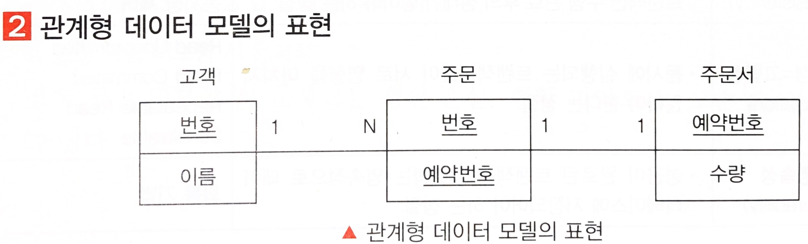
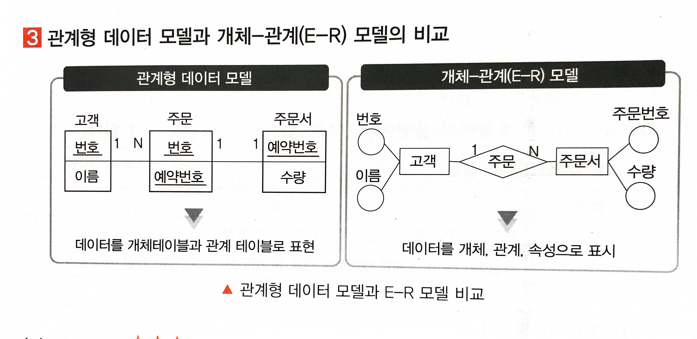
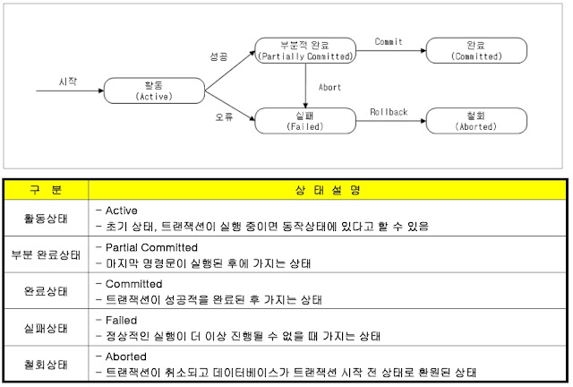
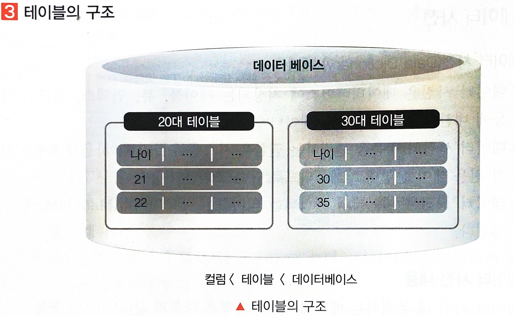
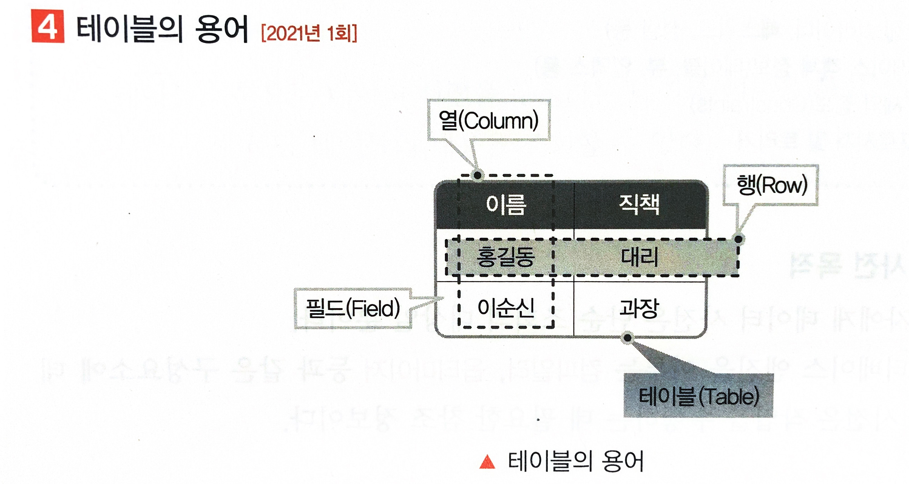

### 1. 2022년 01월 24일 정보처리기사

<h1>기본 SQL 작성</h1><br>

# 1. <span style ="color:red">데이터 정의어

- 데이터 정의어 (DDL; Data Definition Language)의 개념

  - 데이터 저의어는 데이터를 정의하는 언어로서 '데이터를 담는 그릇을 정의하는 언어'이다.
  - 테이블과 같은 데이터 구조를 저의하는 데 사용되는 명령어들로 특정 구조를 생성, 변경, 삭제, 이름을 바꾸는 데이터 구조와 관련된 명령어들을 데이터 정의어라고 부른다.

- DDL의 대상

  - DDL 대상에는 도메인, 스키마, 테이블, 뷰, 인덱스가 있다.

  | DDL 대상 | 설명                                                                                                                                    |
  | -------- | --------------------------------------------------------------------------------------------------------------------------------------- |
  | 도메인   | 하나의 속성이 가질 수 있는 원자값들의 집합<br> 속성의 데이터 타입과 크기, 제약조건 등의 정보                                            |
  | 스키마   | 데이터베이스의 구조, 제약조건 등의 정보를 담고 있는 기본적인 구조<br>스키마는 외부/개념/내부 3계층으로 구성되어 있음(상세내용 각주참고) |
  | 테이블   | 데이터저장공간                                                                                                                          |
  | 뷰       | 하나이상의 물리 테이블에서 유도되는 가상의 테이블                                                                                       |
  | 인덱스   | 검색을 빠르게 하기 위한 데이터구조                                                                                                      |

  ```
  외부스키마-> 사용자나 개발자의 관점에서 필요로 하는 데이터베이스의 논리적 구조
           -> 사용자 뷰를 나타냄
           -> 서브 스키마로 불림
  개념 스키마-> 데이터베이스의 전체적인 논리적 구조
            -> 전체적인 뷰를 나타냄
            -> 개체간의 관계, 제약조건, 접근권한, 무결성, 보안에 대해 정의
  내부 스키마-> 물리적 저장장치의 관점에서 보는 데이터베이스 구조
            -> 실제로 데이터베이스에 저장될 레코드의 형식을 정의하고 저장 데이터 항목의 표현 방법, 내부 레코드의 물리적 순서 등을 표현
  ```

- DDL 명령어

  - DDL 명령어는 CREATE, ALTER, DROP, TRUNCATE가 있다.

  | 구분 | DDL 명령어       | 설명                                                          |
  | ---- | ---------------- | ------------------------------------------------------------- |
  | 생성 | CREATE           | 데이터베이스 오브젝트 생성                                    |
  | 수정 | ALTER            | 데이터베이스 오브젝트 변경                                    |
  | 삭제 | DROP<BR>TRUNCATE | 데이터베이스 오브젝트 삭제<BR>데이터베이스 오브젝트 내용 삭제 |

  - CREATE 명령어

  ```
  CREATE TABLE 테이블명
  (
    속성명 데이터타입[NOT NULL],
    PRIMARY KEY(기본키),
    UNIQUE(속성명,....),
    FOREIGN KEY(외래키) REFERENCES 참조테이블명(기본키),
    CONSTRAINT 제약조건명 CHECK(조건문),
  );
  ```

  ```
  CREATE TABLE 사원
  (
    이름 VARCHAR(10) NOT NULL,
    사번 VALUE(10) NOT NULL,
    생년월일 VARCHAR(8),
    입사일 DATE,
    PRIMARY KEY(사번),
    FOREIGN KEY(업무) REFERENCES 부서(부서코드),
    CONSTRAINT 나이제한 CHECK(생년월일<'19800101')
  );
  ```

  - CREATE TABLE 속성(제약조건)

  | 속성        | 설명                                                                                                               |
  | ----------- | ------------------------------------------------------------------------------------------------------------------ |
  | PRIMARY KEY | 테이블의 기본 키를 정의<BR> 유일하게 테이블의 각 행을 식별                                                         |
  | FOREIGN KEY | 외래 키를 정의<BR>참조 대상을 테이블(컬럼명)로 명시<BR>열과 참조된 테이블의 열 사이의 외래 키 관계를 적용하고 설정 |
  | UNIQUE      | 테이블 내에서 얻은 유일한 값을 갖도록 하는 속성                                                                    |
  | NOT BULL    | 해당 컬럼은 NULL 값을 포함하지 않도록 하는 속성                                                                    |
  | CHECK       | 개발자가 정의하는 제약조건<BR>참(TRUE)이어야 하는 조건을 지정                                                      |
  | DEFAULT     | 해당 필드의 기본값을 지정                                                                                          |

  - ALTER 명령어

  | 구분        | 문법                                                                     | 설명                                                                                 |
  | ----------- | ------------------------------------------------------------------------ | ------------------------------------------------------------------------------------ |
  | 컬럼 추가   | ALTER TABLE 테이블명 ADD 컬럼명 데이터\_타입;                            | 테이블에 필요한 컬럼을 추가하는 명령어                                               |
  | 컬럼 수정   | ALTER TABLE 테이블명 MODIFY 컬럼명 데이터\_타입 [DEFAULT 값] [NOT NULL]; | 기존 테이블에 존재하는 컬럼의 데이터 유형, 기본값, NOT NULL등의 제약조건에 대한 변경 |
  | 컬럼 삭제   | ALTER TABLE 테이블명 DROP 컬럼명                                         | 테이블에 존재하는 컬럼을 삭제하는 명령어                                             |
  | 컬럼명 수정 | ALTER TABLE 테이블명 RENAME COLUMN 변경전*컬럼명 TO 변경 후*컬럼명       | 테이블의 컬럼명을 변경하는 명령어                                                    |

  - ALTER TABLE 속성
  - CREATE TABLE의 속성에 사용되는 제약 조건인 PRIMARY KEY,FOREIGN KEY, UNIQUE, NOT NULL, CHECK, DEFAULT를 ALTER TABLE에서도 사용할 수 있다.
  - 테이블 생성을 위한 CREATE 문에 제약조건을 명시 후에 ALTER를 통해 테이블 제약조건의 변겨잉 가능하다.

  - DROP 명령어

    - DROP TABLE 테이블명 [CASCADE | RESTRICT]
    - DROP TABLE 명령어의 옵션에는 CASCADE와 RESTRICT가 있다.

    | 옵션     | 설명                                                               |
    | -------- | ------------------------------------------------------------------ |
    | CAESCADE | 테이블을 삭제하는 동안 해당 테이블의 모든 데이터를 삭제하는 명령어 |
    | RESTRICT | 다른 테이블이 삭제할 테이블을 참조 중이면 제거하지 않는 옵션       |

  - TRUNCATE 명령어
    - TRUNCATE TABLE 테이블명

# 2. 관계형 데이터 모델

- 관계형 데이터 모델 개념

  - 관계형 데이터 모델은 보편적인 데이터 모델로, 계층 모델과 망 모델의 복잡한 구조를 단순화 시킨 모델이다.
  - 관계 모델의 대표적 언어로는 SQL이다.
  - 데이터 간의 관계를 기본 키와 이를 참조하는 외래 키로 표현한다.
  - 테이블 간 관계를 1:1, 1:N, N:1, M:N으로 표현한다.

- 관계형 데이터 모델의 표현
  

  - 고객 테이블, 주문 테이블 , 주문서 테이블을 관계 데이터 모델로 표현한다.
  - 고객 테이블의 PRIMARY KEY 는 번호이고, 주문서 테이블의 PRIMARY KEY는 예약 번호이다.
  - 고객 테이블과 주문 테이블은 1:N 관계에 있고, 주문 테이블과 주문서 테이블은 1:1 관계에 있다.

- 관계형 데이터 모델과 개체-관계(E-R) 모델의 비교
  

# 3. <span style ="color:red">트랜잭션(TRANSACTION)

- 트랜잭션의 개념

  - 트랜잭션은 데이터 베이스 시스템에서 하나의 논리적 기능을 정상적으로 수행하기 위한 작업의 기본 단위이다.
  - 트랜잭션은 인가 받지 않은 사용자로 부터 데이터를 보장하기 위해 DBMS가 가져야 하는 특성이다.

- 트랜잭션의 특징
  |특징|설명|주요기법|
  |---|---|---|
  |원자성(ATOMICITY)|트랜잭션을 구성하는 연산 전체가 모두 정상적으로 실행되거나, 모두 취소되어야 하는 성질<BR>트랜잭션의 연산 전체가 성공 또는 실패 되어야 하는 성질|COMMIT/ROLLBACK 회복성 보장|
  |일관성(CONSISTENCY)|시스템이 가지고 있는 고정요소는 트랜잭션 수행 전과 트랜잭션 수행 완료후의 상태가 같아야 하는 성질|무결성 제약조건<BR>동시성제어|
  |격리성=고립성(ISOLATION)|동시에 실행되는 트랜잭션들이 서로 영향을 미치지 않아야 한다는 성질|READ UNCOMMITTED<BR>READ COMMITTED<BR>REPEATABLE READ<BR>SERIALIZABLE|
  |영속성(DURAIBILITY)|성공이 완료된 트랜잭션의 결과는 영속적으로 데이터베이스에 저장되어야 하는 성질| 회복기법|

* 트랜잭션 연산(원자성 주요 기법)
  - 트랜잭션 연산에는 커밋과 롤백이 있다.
  - COMMIT과 ROLLBACK 명령어에 의해 원자성을 보장받는다.

| 연산 | 설명                                                                                                                            |
| ---- | ------------------------------------------------------------------------------------------------------------------------------- |
| 커밋 | 하나의 트랜잭션이 성공적으로 끝나고, 데이터베이스가 일관성 있는 상태에 있거나 하나의 트랜잭션이 끝났을때 사용하는 연산          |
| 롤백 | 하나의 트랜잭션이 비정ㅅ아적으로 종료되어 트랜잭션 원자성이 깨질 경우 처음부터 다시 시작하거나, 부분적으로 연산을 취소하는 연산 |

- 병행제어 (일관성주요기법)

  - 병행제어개념
    - 병행제어는 다수 사용자 환경에서 여러 트랜잭션을 수행할 때, 데이터베이스 일관성 유지를 위해 상호작용을 제어하는 기법이다.
  - 병행제어의 목적
    - 데이터 베이스의 공유를 최대화한다.
    - 시스템의 활용도를 최대화 한다.
    - 데이터베이스의 일관성을 유지한다.
    - 사용자에 대한 응답 시간을 최소화 한다.
  - 병행 제어 미보장 시 문제점

    - 병행제어 미보장 시 문제점은 갱신 손실, 현황 파악 오류, 모순성, 연쇄복귀가 있다.

    | 문제점                      | 설명                                                                                                                   |
    | --------------------------- | ---------------------------------------------------------------------------------------------------------------------- |
    | 갱신손실(LOST UPDATE)       | 먼저 실행된 트랜잭션의 결과를 나중에 실행된 트랜잭션이 덮어 쓸때 발생하는 오류                                         |
    | 현황 파악오류(DIRTY READ)   | 트랜잭션의 중간 수행 결과를 다른 트랜잭션이 참조하여 발생하는 오류                                                     |
    | 모순성(INCONSISTENCY)       | 두 트랜잭션이 동시에 실행되어 데이터베이스의 일관성이 결여되는 오류                                                    |
    | 연쇄복기(CASCADINGROLLBACK) | 복수의 트랜잭션이 데이터 공유 시 특정 트랜잭션이 처리를 취소할 경우 트랜잭션이 처리한 곳의 부분을 취소하지 못하는 오류 |

  - 병행제어 기법의 종류

  | 기법                                                    | 설명                                                                                                                                                                                                                                                                                                                                                                                                                                 |
  | ------------------------------------------------------- | ------------------------------------------------------------------------------------------------------------------------------------------------------------------------------------------------------------------------------------------------------------------------------------------------------------------------------------------------------------------------------------------------------------------------------------ |
  | 로킹(LOCKING)                                           | 같은 자원을 액세스하는 다중 트랜잭션 환경에서 DB의 일관성과 무결성을 유지하기 위해 트랜잭션의 순차적 진행을 보장하는 직렬화 기법<BR>로킹의 특징은 다음과 같음<BR>! 데이터 베이스, 파일,레코드 등은 로킹 단위가 될 수 있음<BR>! 로킹 단위가 작아지면 데이터베이스 공유도가 증가<BR>! 로킹 단위가 작아지면 로킹 오버헤드가 증가<BR>!한꺼번에 로킹할 수 있는 객체의 크기를 로킹 단위라고함<BR>로킹 단위가 작아지면 병행성 수준이 낮아짐 |
  | 낙관적 검증(OPTIMISTIC VALIDATION)                      | 트랜잭션이 어떠한 검증도 수행하지 않고 일단 트랜잭션을 수행하고,트랜잭션 종료 시 검증을 수행하여 데이터베이스에 반영하는 기법                                                                                                                                                                                                                                                                                                        |
  | 타임 스탬프 순서(TIME STAMP ORDERING)                   | 트랜잭션과 트랜잭션이 읽거나 갱신한 데이터에 대해 트랜잭션이 실행을 시작하기 전에 타임스탬프를 부여하여 부여된 시간에 따라 트랜잭션 작업을 수행하는 기법                                                                                                                                                                                                                                                                             |
  | 다중버전 동시성 제어(MULTI-VERSION CONCURRENCY CONTROL) | 트랜잭션의 타임스탬프와 접근하려는 데이터의 타임스탬프를 비교하여 직렬가능성이 보장되는 적절한 버전을 선택하여 접근 하도록 하는 기법                                                                                                                                                                                                                                                                                                 |

  - 데이터베이스 고립화 수준(격리성 주요 기법)

    - 고립화 수준(ISOLATION LEVEL)개념
      - 고립화 수준은 다른 트랜잭션이 현재의 데이터에 대한 무결성을 해치지 않기 위해 잠금을 설정하는 정도이다.
    - 고립화 수준 종류

      - 고립화 수준 종류는 READ UNCOMMITTED, READ COMMITTED, REPEATABLE READ, SERIALIZABLE READ 이다.

      | 수준              | 설명                                                                                                                                                                  |
      | ----------------- | --------------------------------------------------------------------------------------------------------------------------------------------------------------------- |
      | READ UNCOMMITTED  | 한 트랜잭션에서 연산 중인 데이터를 다른 트랜잭션이 읽는 것을 허용하는 수준<BR>연산중인 데이터에 대한 연산은 불허                                                      |
      | READ COMMITTED    | 한 트랜잭션에서 연산을 수행할 때, 연산이 완료될 때까지 연산 대상 데이어테 대한 읽기를 제한하는 수준<BR>연산이 완료되어 커밋된 데이터는 다른 트랜잭션이 읽는 것을 허용 |
      | REPEATABLE READ   | 선행 트랜잭션이 특정 데이터를 읽을 때, 트랜잭션 종료 시까지 해당 데이터에 대한 갱신/삭제를 제한하는 수준                                                              |
      | SERIALIZABLE READ | 선행 트랜잭션이 특정 데이터 영역을 순차적으로 읽을 때, 해당 데이터 영역 전체에 대한 접근 제한하는 수준                                                                |

    - 회복기법(영속성 주요기법)

      - 회복(RECOVERY) 기법 개념
        - 회복 기법은 트랜잭션을 수행하는 도중 장애로 인해 손상된 데이터베이스를 손상되기 이전의 정상적인 상태로 복구시키는 작업이다.
      - 회복 기법 종류

        - 회복 기법 종류에는 로그 기반 회복 기법인 지연 갱신 회복 기법, 즉각 갱신 회복기법, 체크 포인트 회복기법, 그림자 페이징 회복기법이 있다.

        | 기법                   | 설명                                                                                                                                                                                                             |
        | ---------------------- | ---------------------------------------------------------------------------------------------------------------------------------------------------------------------------------------------------------------- |
        | 로그기반 회복기법      | 지연 갱신 회복 기법과 즉각 갱신 회복 기법이 있음<BR>지연 갱신 회복기법(트랜잭션이 완료되기 전까지 데이터 베이스에 기록하지 않는기법)<BR>즉각 갱신 회복기법(트랜잭션 수행 중 갱신 결과를 바로 DB에 반영하는 기법) |
        | 체크 포인트 회복 기법  | 장애 발생 시 검사점 이후에 처리된 트랜잭션에 대해서만 장애 발생 이전의 상태로 복원시키는 회복기법                                                                                                                |
        | 그림자 페이징 회복기법 | 데이터베이스 트랜잭션 수행 시 복제본을 생성하여 데이터베이스 장애 시이를 이용해 복구하는 기법                                                                                                                    |

  - 트랜잭션의 상태 변화

  

  - 트랜잭션 제어

    - 트랜잭션 제어 언어는 트랜잭션의 결과를 허용하거나 취소하는 목적으로 사용되는 언어이다.

    | 명령어                  | 핵심           | 설명                                |
    | ----------------------- | -------------- | ----------------------------------- |
    | 커밋(COMMIT)            | 트랜잭션 확정  | 트랜잭션을 메모리에 영구적으로 저장 |
    | 롤백(ROLLBACK)          | 트랜잭션 취소  | 트랜잭션을 메모리에서 무효화시킴    |
    | 체크 포인트(CHECKPOINT) | 저장 시기 설정 | ROLLBACK을 위한 시점을 지정         |

# 4. <span style ="color:red">테이블(TABLE)

- 테이블 개념

  - 테이블은 데이터를 저장하는 항목인 필드(FIELD)들로 구성된 데이터의 집합체이다.
  - 하나의 DB내에 여러 개의 테이블들로 구성될 수 있고, 릴레이션(RELATION)혹은 엔터티(ENTITY)라고도 불린다.

- 테이블의 구성 조건

  - 테이블에 포함된 행들은 유일해야하고 중복된 행이 존재하지 않아야 한다.
  - 테이블에 포함된 행들 간에는 순서가 존재하지 않는다.
  - 테이블을 구성하는 열들 간에는 순서가 존재하지 않는다.

- 테이블의 구조
  

- 테이블의 용어
  

  | 용어                             | 설명                                                                                                      |
  | -------------------------------- | --------------------------------------------------------------------------------------------------------- |
  | 튜플(TUPLE)/행(ROW)              | 테이블 내의 행을 의히하며 레코드(RECORD)라고도 함<BR>튜플은 릴레이션(RELATION)에서 같은 값을 가질 수 없음 |
  | 애트리뷰트(ATTRIBUTE)/열(COLUMN) | 테이블 내의 열을 의미<BR>열의 개수를 디그리(DEGREE)라고 함                                                |
  | 식별자(IDENTIFIER)               | 여러 개의 집합체를 담고 있는 관계형 데이터베이스에서 각각의 구분 할 수 있는 논리적인 개념                 |
  | 카디널리티(CARDINALITY)          | 튜플의 개수                                                                                               |
  | 차수(DEGREE)                     | 애트리뷰트(ATTRIBUTE)의 개수                                                                              |
  | 도메인(DOMAIN)                   | 하나의 애트리뷰트가 취할 수 있는 같은 타입의 원자값 들의 집합                                             |

# 5. <span style ="color:red">데이터 사전

- 데이터 사전(DATA DICTIONARY) 개념

  - 데이터 사전은 데이터베이스에 저장되는 테이블, 뷰, 인덳, 접근 권한등에 대한 정보를 저장하는 데이터 베이스이다.
  - 데이터 사전의 내용을 변경하는 권한은 시스템이 가지며, 사용자에게는 읽기 전용 테이블 형태로 제공되므로 단순 조회만 가능하다.
  - 데이터 사전은 데이터의 데이터를 의미하는 메타데이터(METADATA)로 구성된다.

- 데이터 사전 내용

  - 데이터 사전 내 존재하는 메타데이터의 유형은 다음과 같다. (DBMS 공통)

  ```
  사용자 정보(아이디,패스워드,성별 등)
  데이터베이스 객체 정보(테이블, 뷰, 인덱스 등)
  무결성 제약 정보(CONSTRAINTS)
  함수, 프로시저 및 트리거
  ```

- 데이터 사전 목적

  - 사용자에게 데이터 사전은 단순 조회의 대상일 뿐이다.
  - 데이터베이스 엔진을 이루는 <span style ="color:red">컴파일러, 옵티마이저</SPAN> 등과 같은 구성 요소에 데이터 사전은 작업을 수행하는 데 필요한 참조 정보이다.

  ```
  컴파일러(COMPILER) : 특정 프로그래밍 언어로 쓰여진 소스 코드를 다른 프로그래밍 언어(목적코드)로 바꿔주는 번역 프로그램이다.

  옵티마이저(OPTIMIZER) : 사용자가 질의한 SQL 문을 처리 할 수 있는 실행 계획을 탐색하고 각 실행 계획에 대한 비용을 추정하여 최적의 실행계획을 수립하는 DBMS의 핵심 엔진이다.
  ```

- 데이터 사전 검색

  - ORACLE 데이터 사전 검색

    - ORACLE 사용자는 뷰로 데이터 사전에 접근할 수 있다.
    - 오라클에서 데이터 사전과 관련된 뷰는 DBA*,ALL*,USER* 세 가지 영역이 있다(우선순쉬: DBA*> ALL*> USER*)
    - 오라클(ORACLE)에서는 영역 지시자(DBA, ALL, USER)뒤에 <span style ="color:red">오브젝트</SPAN> 명을 붙이는 형태로 뷰의 이름이 결정된다.

    | 명령어 | 설명                                                                             | 사례                                                                                    |
    | ------ | -------------------------------------------------------------------------------- | --------------------------------------------------------------------------------------- |
    | DBA\_  | 데이터베이스의 모든 객체 조회가능(DBA는 시스템 접근권한)                         | SELECT _ FROM DBA_TABLES;<BR>SELECT _ FROM DBA_INDEXES;<BR>SELECT \* FROM DBA_VIEWS;    |
    | ALL\_  | 자신의 계정으로 접근 가능한 객체와 타계정의 접근 권한을 가진 모든 객체 조회 가능 | SELECT _ FROM ALL_TABLES;<BR>SELECT _ FROM ALL_INDEXES;<BR>SELECT \* FROM ALL_VIEWS;    |
    | USER\_ | 현재 자신의 계정이 소유한 객체 조회가능                                          | SELECT _ FROM USER_TABLES;<BR>SELECT _ FROM USER_INDEXES;<BR>SELECT \* FROM USER_VIEWS; |

  - MYSQL 데이터 사전 검색
    - 데이터 사전은 테이블 형태로 구성되어 있다.
    - MYSQL에서 데이터 사전은 INFORMATION_SCHEMA 데이터베이스 안에 존재한다.
    - 테이블을 조회하기 위해서는, 우선 해당 데이터 베이스로 이동해서 테이블 목록을 요청해야한다.
    ```
    USE INFORMATION_SCHEMA; --이동
    SHOW TABLES; --테이블 목록 요청
    ```
    - 테이블 목록으로 데이터 사전을 구성하는 테이블 이름을 확인하고, SELECT문을 통해 해당 테이블의 내용을 조회할 수 있다.

---
