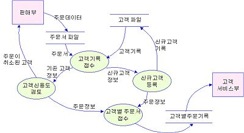

### 1. 2022년 01월 19일 정보처리기사

<h1>요구사항확인</h1><br>

# 1. <span style ="color:red">요구분석 기법

- 요구분석 개념
  - 요구분석은 도출된 요구사항 간 상충을 해결하고 소프트웨어의 범위를 파악하여 외부환경과의 상호 작용을 분석하는 과정이다.
  - 요구분석은 개발 대상에 대한 사용자의 요구사항 중 명확하지 않거나 모호하여 이해되지 않는 부분을 발견하고 이를 걸러내기 위한 과정이다.
  - 외부환경이란?<br>
    하드웨어, 소프트웨어, 네트워크등의 환경이다.

<br>

- 요구 분석의 특징
  - 요구 분석은 소프트웨어 개발의 실제적인 첫 단계로 사용자의 요구에 대해 이해하는 단계이다.
  - 분석 결과의 문서화를 통해 향후 유지보수에 유용하게 활용할 수 있다.
  - 보다 구체적인 명세를 위해 **_소단위 명세서_**가 활용될 수 있다.
  - 개발 비용이 가장 많이 소요되는 단계는 아니다. (개발비용이 가장 많이 소요되는 단계는 <span style = "color:orangered">**_유지보수_**</span>)
  - 요구 분석 중 도메인 분석은 요구에 대한 정보를 수집하고 배경을 분석하여 이를 토대로 모델링을 하게 된다.

<br>

- 요구사항 분석 단계 절차
  - 요구사항 분석을 통해서 요구사항을 기술할 때에는 **<span style = "color:orangered"> 요구사항의 확인 (Validation),요구사항 구현의 검증(Verification), 비용 추정</span>** 이 가능하도록 충분하고 정확하게 기술 해야한다.
  - 소단위 명세서<br>
    - 데이터 흐름도에 나타나 있는 처리 항목을 1~2 페이지 정도의 소규모 분량으로 요약하여 작성하는 논리적 명세서이다.

| 순서 | 절차                     | 설명                                                                                                                                                                                                                                                                                                                                              |
| ---- | ------------------------ | ------------------------------------------------------------------------------------------------------------------------------------------------------------------------------------------------------------------------------------------------------------------------------------------------------------------------------------------------- |
| 1    | 요구사항분류             | ▷ 요구사항이 기능인지 비 기능인지 확인<br><br> ▷ 요구사항이 소프트웨어에 미치는 영향의 범위를 파악 <br><br>▷ 요구사항이 소프트웨어 생명주기 동안 변경이 발생하는지를 확인 <br><br>▷ 하나 이상의 상위 요구사항에서 유도된 것인지 또는 이해관계자나 다른 원천으로부터 직접 발생한 것인지 분류                                                       |
| 2    | 개념 모델링 생성 및 분석 | ▷ 요구사항을 더 쉽게 이해할 수 있도록 현실 세계의 상황을 단순화, 개념적으로 표현한 것을 모델이라고 하며, 모델링은 이러한 모델을 만드는 과정 <br><br>▷ 객체 모델, 데이터 모델, 상태, 모델 등 다양한 모델 작성 가능<br><br> ▷ 모델링 표기를 위해 <span style = "color:orangered">**_DFD( Data Flow Diagram), UML 다이어그램, E-R 다이어그램 사용_** |
| 3    | 요구사항 할당            | ▷ 요구사항을 만족시키기 위한 아키텍처 구성요소를 식별하는 활동<br><br> ▷ 다른 구성요소와 어떻게 상호 작용하는지 분석을 통해 추가적인 요구 사항을 발견 가능                                                                                                                                                                                        |
| 4    | 요구사항 협상            | ▷ 두 명의 이해관계자가 서로 상충되는 내용을 요구하는 경우, 어느 한 쪽을 지지하기보다는 적절한 지점에서 합의하기 위한 기법 <br><br>▷ 요구사항이 서로 충돌되는 경우 각각 우선순위를 부여하면 무엇이 더 중요한지를 인식할 수 있으므로 문제 해결에 도움이 됨                                                                                          |
| 5    | 정형분석                 | ▷ 형식적으로 정의된 의미를 지닌 언어로 요구사항을 표현<br><br> ▷ 구문(Syntax)과 의미(Semantics)를 갖는 정형화된 언어를 사용하여 수학적 기호로 표현 <br><br>▷ 요구사항 분석의 마지막 단계에서 이루어짐                                                                                                                                             |

```
* 요구사항 모델링은 주로 UML을 사용합니다.
* 주요 UML 다이어그램에는 유스케이스 다이어그램(Use Case Diagram),시퀀스 다이어그램(Sequence Diagram)이 있습니다.
* 애자일(Agile) 방법론을 적용해서 요구사항 모델링을 빠르고 효과적으로 만들 수 있습니다.
```

- 요구사항 분석 기술
  - 요구 사항 분석 기술에는 청취 기술, 인터뷰와 질문 기술, 분석 기술, 중재 기술, 관찰 기술, 작성 기술, 조직 기술, 모델 작성 기술이 있다.

| 분석기술           | 설명                                                                                                      |
| ------------------ | --------------------------------------------------------------------------------------------------------- |
| 청취기술           | 이해관계자로부터 의견을 듣는 기술                                                                         |
| 인터뷰와 질문 기술 | 이해관계자를 만나 정보를 수집하고 이야기를 나누는 기술                                                    |
| 분석기술           | 추출된 요구사항에 대해 충돌, 중복, 누락등의 분석을 통해 완전성과 일관성을 확보하는 기술                   |
| 중재기술           | 이해 관계자들의 상반된 요구에 대한 중재기술                                                               |
| 관찰 기술          | 사용자가 작업하는 것을 관찰하면서 사용자가 언급하지 않은 미묘한 의미를 탐지할 수 있는 기술                |
| 작성기술           | 문서작성기술                                                                                              |
| 조직 기술          | 수집된 방대한 정보를 일관성 있는 정보로 구조화 하는 능력                                                  |
| 모델 작성기술      | 수집한 자료를 바탕으로 제어의 흐름, 기능처리, 동작행위,정보 내용등을 이해하기 쉽도록 모델로 작성하는 기술 |

- 요구사항 분석에 사용하는 기능 모델링 기법

  - 데이터 흐름도 (DFD; Data Flow Diagram)

    - 데이터 흐름도는 데이터가 각 프로세스를 따라 흐르면서 변환되는 모습을 나타낸 그림이다.
    - 시스템 분석과 설계에서 매우 유용하게 사용되는 다이어그램이다.
    - 데이터 흐름도는 시스템의 모델링 도구로서 가장 보편적으로 사용되는 것중의 하나이다.
    - 자료 흐름 그래프 또는 버블(Bubble) 차트라고도 한다.
      
    - 데이터 흐름도 특징
      - 구조적 분석 기법에 이용된다.
      - 데이터의 흐름에 중심을 두는 분석용 도구이다.
      - 제어의 흐름은 중요하지 않다.
      - 시간 흐름을 명확하게 표현 할 수는 없다.
    - 데이터 흐름도 구성요소

      - 데이터 흐름도 구성요소에는 처리기, 데이터 흐름, 데이터 저장소, 단말이 있다.

      | 구성요소                      | 설명                                                                                                                                |
      | ----------------------------- | ----------------------------------------------------------------------------------------------------------------------------------- |
      | 처리기<br>(Process)           | 입력된 데이터를 원하는 형태로 변환하여 출력하기 위한 과정으로, DFD에서는 원(0)으로 표시                                             |
      | 데이터흐름<br>(Data Flow)     | DFD의 구성요소(프로세스,데이터 저장소, 외부 엔터티)들 간의 주고받는 데이터 흐름을 나타내며, DFD에서는 화살표(→)로표시               |
      | 데이터 저장소<br>(Data Store) | 데이터가 저장된 장소이고, 평행선(=)으로 표시하며, 평행선 안에는 데이터 저장소의 이름을 넣음                                         |
      | 단말<br>(Terminator)          | 프로세스 처리 과정에서 데이터가 발생하는 시작고 ㅏ종료를 나타내고, 사각형(ㅁ)으로 표시하며, 사각형 안에는 외부 엔터티의 이름을 넣음 |

  - 자료 사전

    - 자료사전 (DD: Data Dictionary) 개념
      - 자료 사전은 자료요소,자료 요소들의 집합, 자료의 흐름, 자료 저장소의 의미와 그들 간의 관계, 관계값, 범위, 단위들을 구체적으로 명시하는 사전이다.
      - 자료사전은 파일 혹은 데이터베이스에 있는 자료에 대한 자료 또는 각자료 항목에 주어진 이름과 길이 그리고 서술과 같은 데이터를 포함하는 참조를 위한 작업이다.
    - 자료사전의 작성 목적
      - 자료 사전은 조직에 속해 있는 다른 사람들에게 특정한 자료 용어가 무엇을 의미하는지를 알려주기 위하여, 용어의 정의를 조정하고 취합하고 문서로 명확히 하는 목적이 있다.
      - 자료 흐름도에 나타나는 어떤 자료의 흐름도 자료 사전에 정의되어 있어야 한다.
    - 자료 사전 기호

    | 기호 | 설명                                                                                                                                                                                                                                |
    | ---- | ----------------------------------------------------------------------------------------------------------------------------------------------------------------------------------------------------------------------------------- |
    | =    | -> 자료의 정의로서 '~으로 구성되어 (is Composed of)있다' 는 것을 나타내는 기호 <br> -> 정의는 주석을 사용하여 의미를 기술하며, 자료 흐름과 자료저장소에 대한 구성 내역ㄴ을 설명하고, 자료 원소에 대하여 값이나 단위를 나타내는 기호 |
    | +    | -> 자료의 연결 (and,along with)을 나타내는 기호                                                                                                                                                                                     |
    | ()   | -> 자료 생략 가능함을 나타내는 기호                                                                                                                                                                                                 |
    | {}   | -> 자료의 반복을 나타내는 기호<br>-> 반복 횟수를 기록하는데 { }에서 좌측에는 최소 반복 횟수를 기록하고, 우측에는 최대한 반복 횟수를 기록<br>-> 반복 횟수를 기록하지 않을 때는 기본값으로 최소는 0, 최대는 무한대를 나타냄           |
    | []   | -> 자료의 선택을 나타내는 기호<br> -> 택일 기호 [ㅣ] 는 'ㅣ' 로 분리된 항목 중 하나가 선택된다는 것을 표시                                                                                                                          |
    | \*\* | -> 자료의 설명을 나타내는 기호<br> -> 주석(Comment)                                                                                                                                                                                 |

    - 자료 사전의 작성 원칙

    | 작성원칙             | 설명                                                                                                                                                                                                                                                             |
    | -------------------- | ---------------------------------------------------------------------------------------------------------------------------------------------------------------------------------------------------------------------------------------------------------------- |
    | 자료의 의미 기술     | > 자료의 의미는 주석을 통해서 기술<br> > 자료의 의미를 기술할 때는 그 자료가 대상 시스템에서 사용되는 적합한 뜻을 표현 해야함<br> > 중복되는 기술을 회피하는 것은 간결하고 이해하기 쉬운 자료 사전을 작성하는 데 중요함                                          |
    | 자료 구성항목의 기술 | > 구성항목들을 그룹으로 묶음 <br> > 각 그룹에 대하여 의미 있는 이름을 부여<br> > 이름이 붙여진 각 그룹을 다시 정의                                                                                                                                               |
    | 동의어 규정 준수     | > 사용자마다 동일한 문서나 자료에 대해 서로 다른 이름들을 갖고 있을 수 있으며, 사용자들의 용어를 통일시키는 것보다는 사용하는 용어를 이용하여 자료를 정의하는것이 간단함<br> > 분석가가 자료를 하향식으로 분할하는 과정에서 부주의 하게 동의어를 사용 할 수 있음 |
    | 자료 정의의 중복제거 | > 동일한 자료에 대해 여러 명의 분석가가 독립적으로 분석을 시행한다면, 서로 다른 이름을 사용할 수 있기 때문에 자료 정의의 중복제거 필요                                                                                                                           |

- 요구사항 분석이 어려운 이유
  - 개발자와 사용자 간의 지식이나 표현의 차이가 커서 상호 이해가 쉽지않다.
  - 사용자의 요구사항이 모호하고 불명확하다.
  - 소프트웨어 개발 과정 중에 요구사항이 계속 변할 수 있다.
  - 사용자의 요구는 예외가 많아 열거와 구조화가 어려운 편이다.

2.  UML

---
